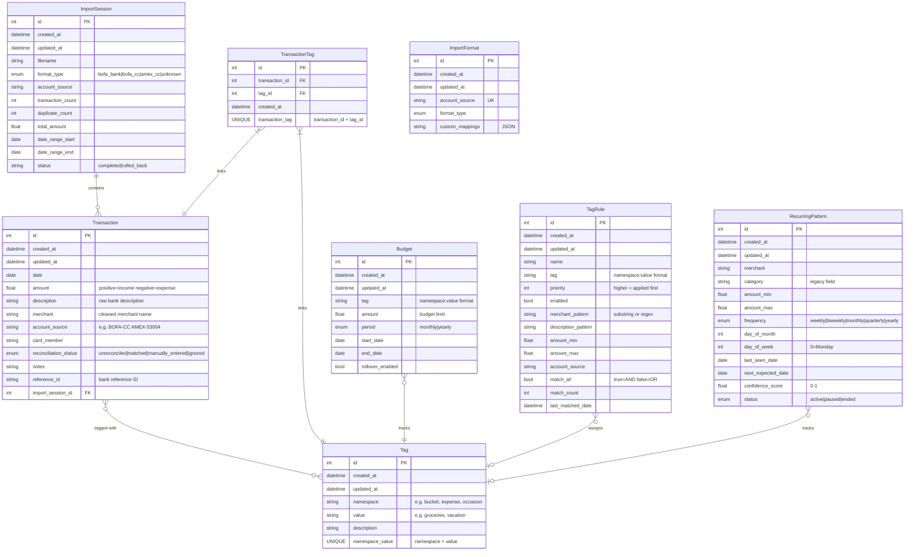

# Data Model

## Entity Relationship Diagram

## Model Descriptions

### ImportSession
Tracks each CSV import batch for auditing and rollback capability. When transactions are imported, they're linked to a session. Deleting a session can remove all its transactions (admin operation with confirmation).

### Transaction
Core entity representing financial transactions from bank/credit card statements. Key fields:
- **amount**: Positive = income, Negative = expense
- **description**: Raw description from bank CSV
- **merchant**: Cleaned/extracted merchant name for tagging
- **account_source**: Identifies the source account (e.g., "BOFA-CC", "AMEX-53004")
- **reference_id**: Bank's unique transaction identifier for duplicate detection

### Tag
Namespaced tags for flexible transaction classification. Tags use a `namespace:value` format:
- **bucket**: Spending categories (groceries, dining, entertainment)
- **expense**: Expense types (recurring, one-time)
- **occasion**: Special events (vacation, christmas)

Each transaction can have multiple tags, but only one tag per namespace (bucket tags are mutually exclusive).

### TransactionTag
Junction table linking transactions to tags (many-to-many relationship).

### Budget
Monthly or yearly spending limits per tag. Uses `namespace:value` format (e.g., `bucket:groceries`). Supports optional date ranges and rollover.

### TagRule
Auto-tagging rules applied to new transactions during import. Supports pattern matching on merchant, description, amount ranges, and account source. Rules are applied by priority (highest first).

### RecurringPattern
Detected recurring transactions (subscriptions, bills). Used to predict upcoming transactions and alert on missing expected charges.

### ImportFormat
Saved preferences for import sources. Remembers which CSV format to use for each account source.

## Import Format Types

| Format | Headers | Notes |
|--------|---------|-------|
| `bofa_bank` | Date,Description,Amount,Running Bal. | BofA checking/savings |
| `bofa_cc` | Posted Date,Reference Number,Payee,Address,Amount | BofA credit card |
| `amex_cc` | Date,Description,Card Member,Account #,Amount,... | American Express |

## Amount Conventions

- **Positive amounts**: Income (deposits, refunds, payments received)
- **Negative amounts**: Expenses (purchases, withdrawals, fees)

This convention is applied during import parsing. Source CSVs may use different conventions which are normalized during import.

## Tag Namespaces

| Namespace | Purpose | Example Values | Auto-created |
|-----------|---------|----------------|--------------|
| `bucket` | Spending categories | groceries, dining, entertainment, utilities | No |
| `account` | Bank accounts/cards with display names | bofa-checking, amex-gold | Yes, on import |
| `expense` | Expense classification | recurring, one-time, refund | No |
| `occasion` | Special events | vacation, christmas, birthday | No |

Tags are stored in `namespace:value` format throughout the system.

### Built-in Namespaces
The following namespaces are built-in and cannot be deleted:
- `bucket`, `account`, `occasion`, `expense`

Custom namespaces can be created through the Tags page.

### Account Tags
Account tags are automatically created during CSV import based on `account_source`. The tag value is the normalized account source (lowercase, dashes for spaces), and the description field serves as the display name shown in the UI.

Example:
- Import with `account_source = "BOFA-Checking"`
- Creates tag: `account:bofa-checking` with description "BOFA-Checking"
- User can edit description to "Bank of America Checking" in Admin → Accounts
