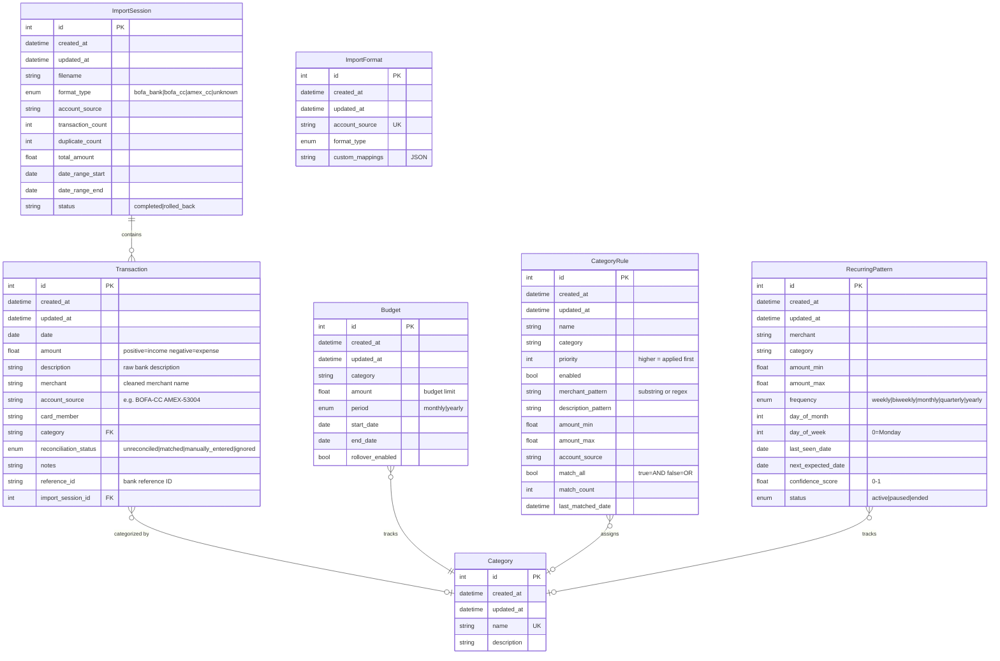

# Data Model

## Entity Relationship Diagram

## Model Descriptions

### ImportSession
Tracks each CSV import batch for auditing and rollback capability. When transactions are imported, they're linked to a session. Deleting a session can remove all its transactions (admin operation with confirmation).

### Transaction
Core entity representing financial transactions from bank/credit card statements. Key fields:
- **amount**: Positive = income, Negative = expense
- **description**: Raw description from bank CSV
- **merchant**: Cleaned/extracted merchant name for categorization
- **account_source**: Identifies the source account (e.g., "BOFA-CC", "AMEX-53004")
- **reference_id**: Bank's unique transaction identifier for duplicate detection

### Category
Simple category definitions. Transactions reference categories by name (not FK) for flexibility.

### Budget
Monthly or yearly spending limits per category. Supports optional date ranges and rollover.

### CategoryRule
Auto-categorization rules applied to new transactions during import. Supports pattern matching on merchant, description, amount ranges, and account source. Rules are applied by priority (highest first).

### RecurringPattern
Detected recurring transactions (subscriptions, bills). Used to predict upcoming transactions and alert on missing expected charges.

### ImportFormat
Saved preferences for import sources. Remembers which CSV format to use for each account source.

## Import Format Types

| Format | Headers | Notes |
|--------|---------|-------|
| `bofa_bank` | Date,Description,Amount,Running Bal. | BofA checking/savings |
| `bofa_cc` | Posted Date,Reference Number,Payee,Address,Amount | BofA credit card |
| `amex_cc` | Date,Description,Card Member,Account #,Amount,... | American Express |

## Amount Conventions

- **Positive amounts**: Income (deposits, refunds, payments received)
- **Negative amounts**: Expenses (purchases, withdrawals, fees)

This convention is applied during import parsing. Source CSVs may use different conventions which are normalized during import.
